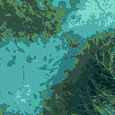
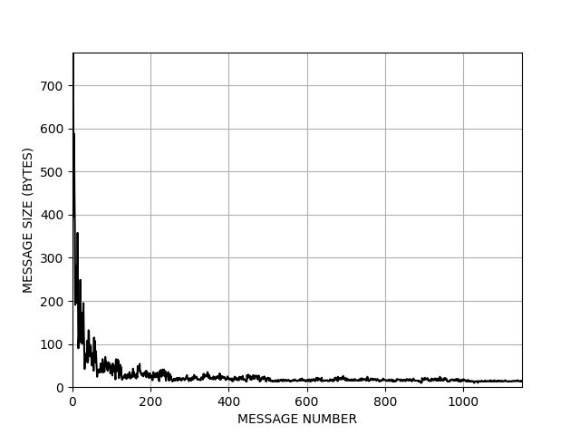

# Progressive Hierarchical Compression Encoder (PHCENCODER)

This code transform an RGB image into a tree structure. The root node contains a color indexed version of the image with a limited number of colors together with the corresponding color palette. Each child node specifies one of the colors in its parent using the same format. The tree is built recursively until the nodes cannot be refined more. The information is stored using the strictly required bits (bit-level encoding). Additionally, the information is compressed using a standard compression algorithm.

The resulting tree most of the times requires less storage than the raw image, though the goal is not to create a small tree but to divide the image in extremely small nodes, each one providing additional details of the image. This is useful in communication constrained environments (such as underwater communications) where these very small nodes could be transmitted as separate messages and the image reconstructed by the receiver from the very first node with increasing level of quality after each new node is received. The proposal includes a tree-traversal approach to transmit the less informative nodes at the very end.

## Citation

Science and programming by Antoni Burguera (antoni dot burguera at uib dot es) - 2022

If you use this software, please cite the following publication.

* To be posted soon. Please, contact the author.


## Provided classes

The provided classes are:

* **PHCNode**:  It is defined in phcimage.py and inherits from the anytree class NodeMixin. It implements a tree node. It is a class used by PHCImage and PHCEncoder and should not be used directly.
* **PHCImage**:  Encapsulates methods to load and save a PHC image as well as to print and plot the tree structure. It does NOT include methods to display or to convert from/to standard image formats. The from/to conversion is performed by the PHCEncoder.
* **PHCEncoder**: Encodes an RGB image into a PHC Image and decodes a PHC Image into an RGB image. In this context, RGB image means numpy array of shape h x w x 3.

## Testing the system

The file phctest performs some basic tests and serves an usage example. You can directly execute it and analyze its output/behavior to understand the system.

## Understanding the system

Some basic usage example is provided next, though phctest.py contains a more detailed example.

Let us load an image and plot it:

```
# Imports
from skimage.io import imread
import matplotlib.pyplot as plt

# Load the image
theImage=imread('IMG/IMG.png')

# Plot it
plt.figure()
plt.imshow(theImage)
plt.show()

```

This is the loaded image:


Now let us encode it into PHC:

```
# Imports
from phcencoder import PHCEncoder

# Create the encoder with 1 bit per palette index. This leads to a binary tree.
# Data is compressed using the gzip algorithm (theCompressor=2)
theEncoder=PHCEncoder(bitsPerPaletteIndex=1,theCompressor=2)

# Encode the image
encodedImage=theEncoder.encode(theImage)
```

Let us decode it up to different numbers of nodes, store the size of these nodes and plot the results:

```
# Initialize sizes storage
theSizes=[]

# Test from maxOrder=0 to maxOrder=9
for maxOrder in range(10):

    # Decode the first maxOrder nodes of the image.
    decodedImage=theEncoder.decode(encodedImage,maxOrder)

    # Store the PHC image size
    theSizes.append(theEncoder._packedSize)

    # Plot the decoded image.
    plt.figure()
    plt.imshow(decodedImage)
    plt.show()
    
```

The obtained images are the following. The number of nodes inolved in each image is shown above them and the size of all the nodes involved (the theSizes vector in the previous code) is shown below them.

<center>

| maxOrder=0                        | maxOrder=1                         | maxOrder=2                        | maxOrder=3                         | maxOrder=4                        |
| :-------------------------------: | :--------------------------------: | :-------------------------------: | :--------------------------------: | :-------------------------------: |
|  |   |  |   |  |
| 720 bytes                         | 2116 bytes                         | 3082 bytes                        | 3900 bytes                         | 4277 bytes                        |
| __maxOrder=5__                    | __maxOrder=6__                     | __maxOrder=7__                    | __maxOrder=8__                     | __maxOrder=9__                    |
|  |   |  |   |  |
| 4758 bytes                        | 5337 bytes                         | 5820 bytes                        | 6032 bytes                         | 6446 bytes                        |

</center>


The quality when using a few number of nodes is low (though the main features of the image can be appreciated) but the size is also small. For example, the first node is only 720 bytes and the two first nodes together are 2116 bytes. The results using 10 nodes are close to the original image with only 6446 bytes (below a 90% quality JPG wich is, in this case, 7284 bytes and far below the original PNG size which is 31.4 KB). Note also that the 6446 bytes of using 10 nodes is not a single file or message, but 10 separated messages/files with an average size of 644 bytes.

The two Figures below show the evolution of image error (mean squared error) with respect to the total size of the involved nodes (left) and individual node sizes (right) for the same image and configuration before. The size of the PNG file and raw image data are also shown (in both cases, error is zero by definition).

<center>

| Size vs error | Node size |
| ------------------- | --------------- |
|  |  | 

</center>


## Additional features

It is possible to configure:

* The number of bits per palette index. Small values spreads the image across more small nodes whilst large values spread it in less, larger, nodes.
* The number of bits per palette entry. Small values slightly decrease the node size but largely increase the image error. Also, values below 8 lead to lossy compression. The maximum value of 8 is recommended.
* The compression algorithm.
* The algorithm to clusterize the color space in each node. It can be K-Means or just a linear interpolation.

It should also be possible (though this feature is not used) to reconstruct a grayscale version of the image if palette is not received since indexes are sorted from darkest to clearest.

Check the comments in the code to learn about these options.


## Requirements

To use this code you need Python 3 and the following Python libraries:

* NumPy
* Matplotlib
* skimage
* scipy
* bitarray
* gzip
* snappy
* lzma
* sklearn
* json
* itertools
* anytree

## Disclaimer

The code is provided as it is. It may work in your computer, it may not work. It may even crash it or create a paradox that could ultimately unravel the very fabric of the space-time continuum and destroy the entire universe. Just be careful and try to understand everything before using it. If you have questions, please carefully read the code. If this doesn't help, contact us. If you want to blame us for some reason, do not contact us.